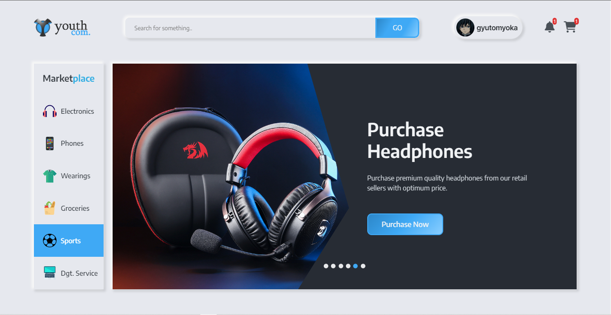

 
 
 
<h1>🎧Hello!</h1>

Please! Also take a look at my primary <a href="https://github.com/Hasibul-Hasan-ofcs">github_profile</a>.

 
<h2>Youth Com Project youtube video link <a href="https://youtu.be/ulmRxcQI8dk">https://youtu.be/ulmRxcQI8dk</a></h2>
 
<h2>Youth Com is live(Cloud Upload) on <a href="https://youth-com-web.herokuapp.com">https://youth-com-web.herokuapp.com</a></h2>
 

<h3>my youtube <a href="https://www.youtube.com/channel/UCrngPUQZMRZ63ZG7O0vlpuA/videos">videos</a> </h3>
